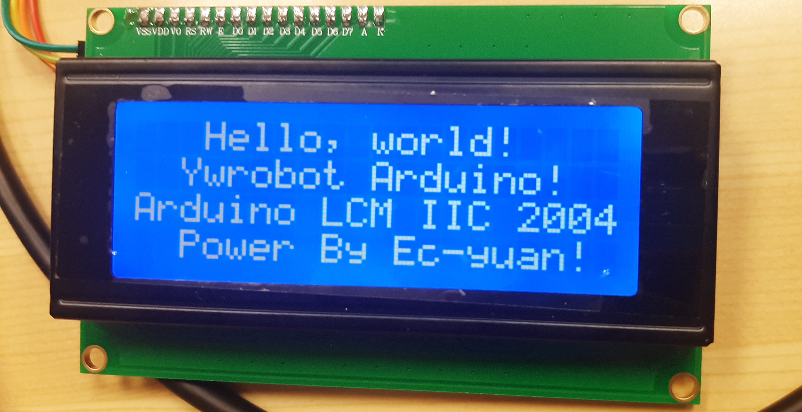
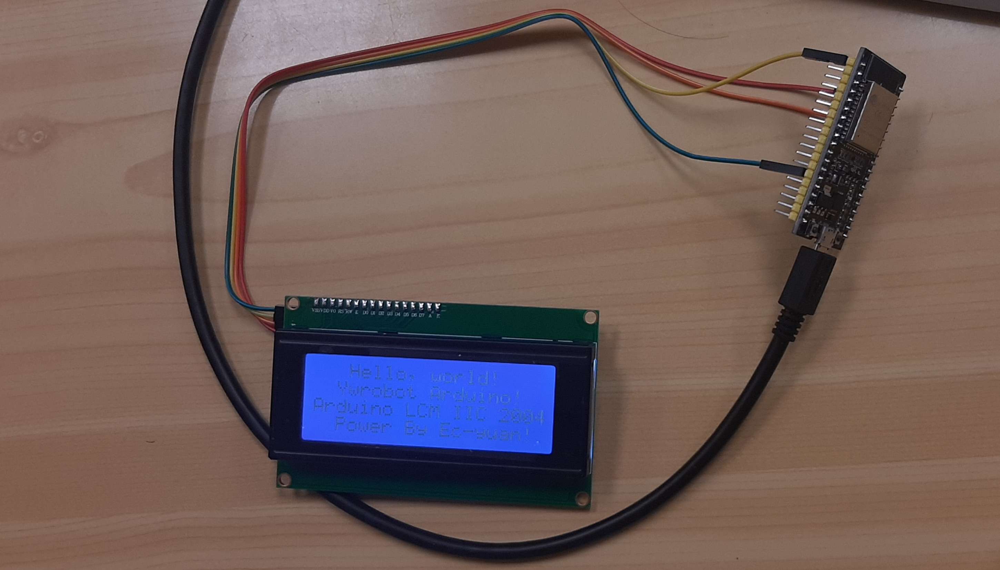
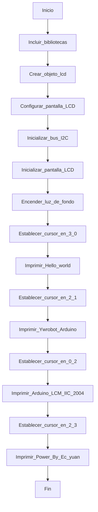

# Práctica 5 parte 2

## Código

```c++

    #include <Arduino.h>
    #include <LiquidCrystal_I2C.h>

    LiquidCrystal_I2C lcd(0x27,20,4);  // set the LCD address to 0x27 for a 16 chars and 2 line display

    void setup()
    {
    Wire.begin(21,22);
    lcd.init();                      // initialize the lcd 
    // Print a message to the LCD.
    lcd.backlight();
    lcd.setCursor(3,0);
    lcd.print("Hello, world!");
    lcd.setCursor(2,1);
    lcd.print("Ywrobot Arduino!");
    lcd.setCursor(0,2);
    lcd.print("Arduino LCM IIC 2004");
    lcd.setCursor(2,3);
    lcd.print("Power By Ec-yuan!");
    }

    //mueve el cursor en una posición y hace el print

    void loop()
    {
    }

```


### Descripción:

Se ha configurado una pantalla LCD a través del bus I2C y muestra un mensaje en ella.

Para llevarlo a cabo hemos añadido la libreria LiquidCrystal_I2C y usando esta libreria hemos creado un objeto en el que especificamos la dirección del I2C de la pantalla, el número de columnas y el número de filas.

Usamos el **void setup()** para inicializar el programa. Dentro de él usamos la funcion Wire.begin() para inicializar los pines que se usaran como SDA Y SCL. También inicializamos la pantalla y un cursor.

Usaremos este cursor con su determinada posición para imprimir los mensajes en la pantalla.

En este caso la función **void loop()** está vacía ya que no se raliza ninguna operación adicional, lo que significa que el programa se queda en bucle infinito.

Esto es lo que mostrará la pantalla: 

 

Esta es la foto del montaje: 

 


### Conclusión:

En conclusión, hemos usado este codigo para imprimir un mensaje estático en una pantalla LCD usando un bus I2C y su dirección. También hemos comprendido el uso de los cursores para imprimir mensajes en distintas posiciones y hemos experimentado con libreías.

### Diagrama de flujo para comprender mejor su funcionamiento:

